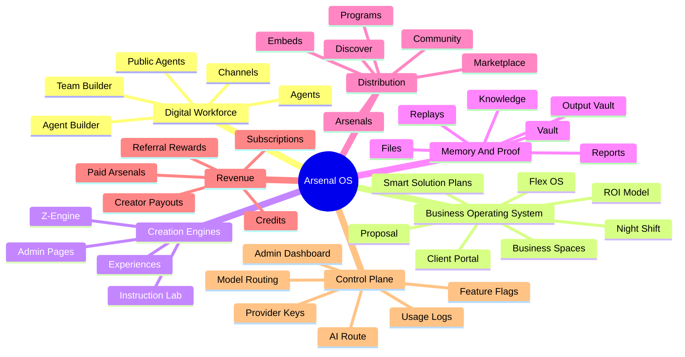
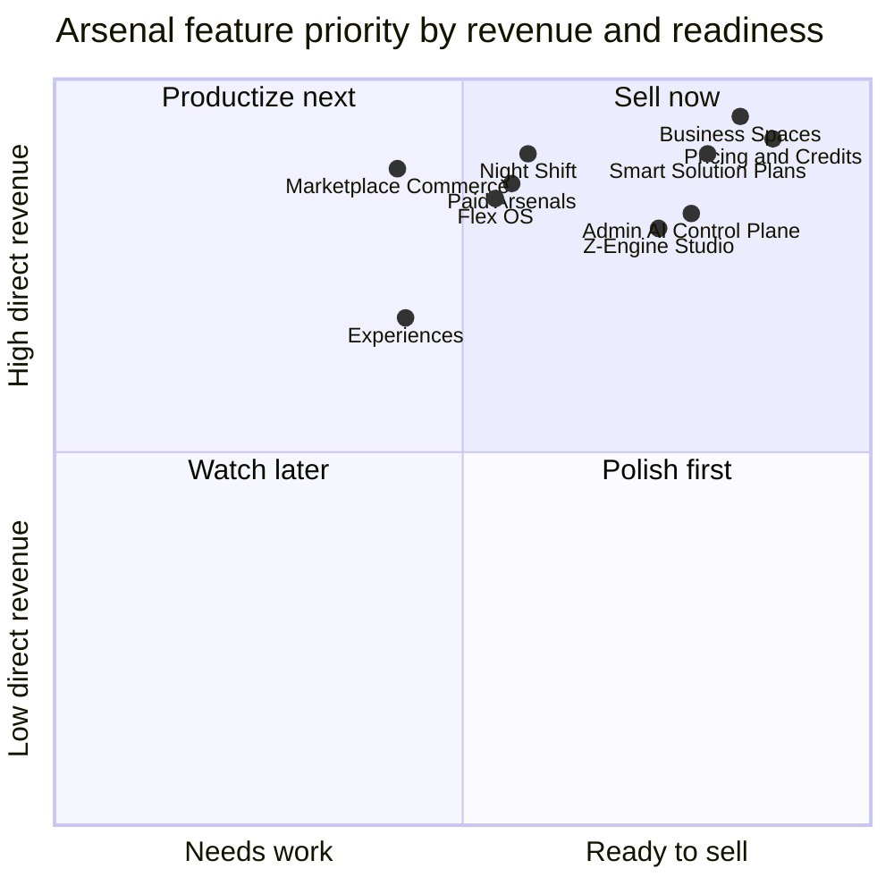
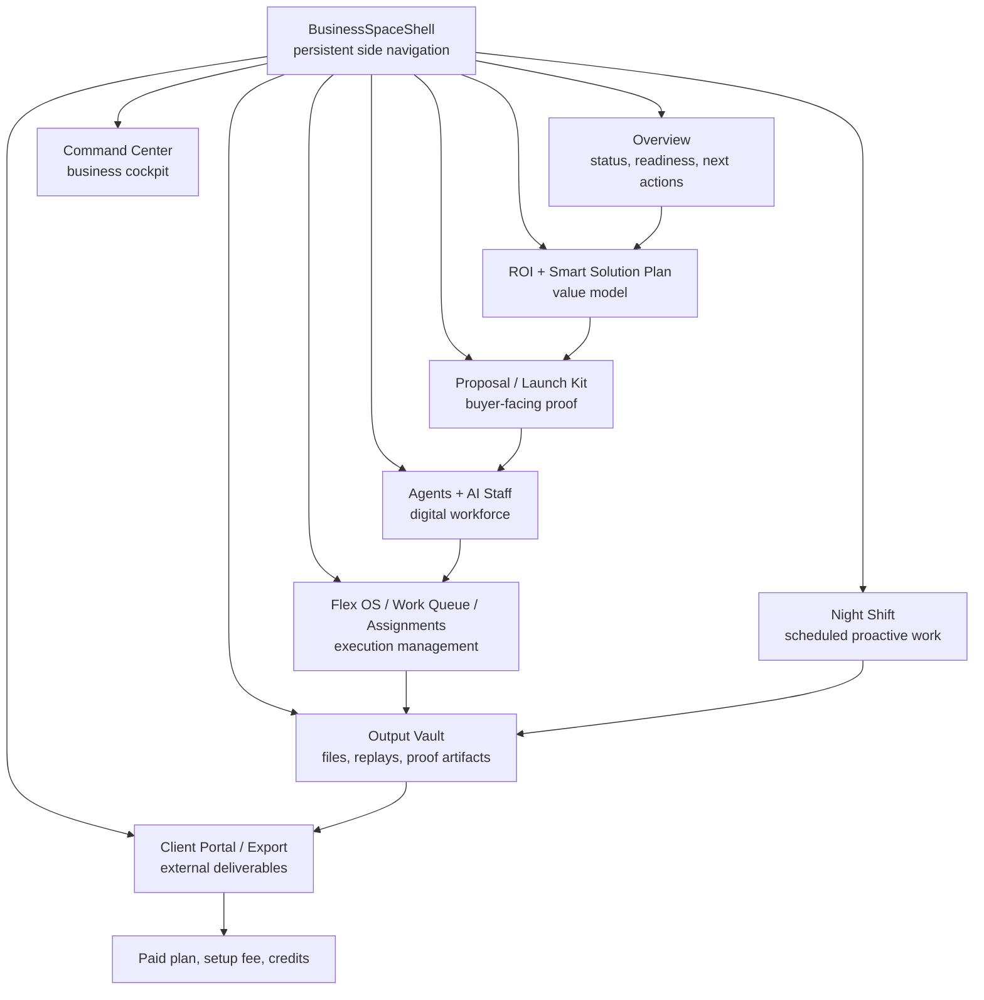

# Visual Atlas

This is the visual layer of Arsenal Atlas. It is meant for Alex, designers, marketers, investors, and future Codex runs that need to see the platform as systems, screens, revenue loops, and product maps instead of long prose.

## 1. Platform Mindmap

## 2. Feature Revenue Quadrant

## 3. Screenshot Storyboard

```mermaid
flowchart LR
  A[1 Dashboard<br/>OS overview] --> B[2 Business Spaces<br/>B2B value]
  B --> C[3 Command Center<br/>workspace cockpit]
  C --> D[4 ROI<br/>measurable case]
  D --> E[5 Proposal<br/>sales proof]
  E --> F[6 Night Shift<br/>proactive work]
  F --> G[7 Output Vault<br/>proof layer]
  G --> H[8 Agent Builder<br/>digital worker]
  H --> I[9 Share Studio<br/>deploy everywhere]
  I --> J[10 Z-Engine<br/>creation engine]
  J --> K[11 Admin AI Map<br/>control plane]
  K --> L[12 Pricing<br/>conversion]
```

## 4. Business Spaces Screen Architecture

## 5. Visual Reading Order

1. Start with the Platform Mindmap.
2. Show the Feature Revenue Quadrant.
3. Use the Business Spaces Screen Architecture to explain the flagship paid product.
4. Use the Screenshot Storyboard for marketing and investor capture order.
5. Use the Route Cluster Subway Map when Codex or engineering needs to understand navigation.
6. Use the Data Model Feature Families diagram when discussing backend trust and scale.
