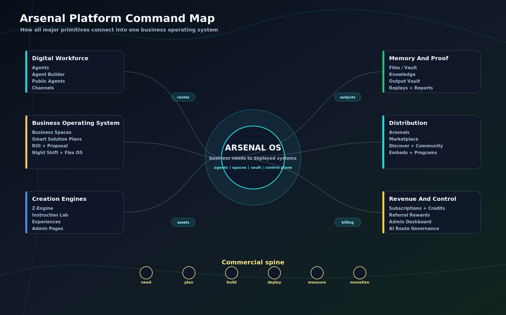
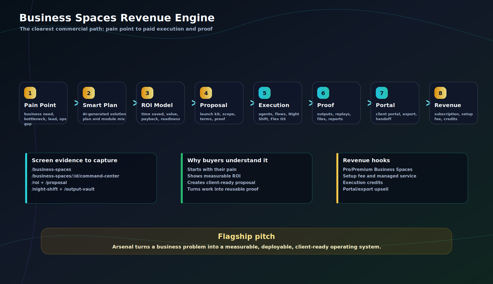
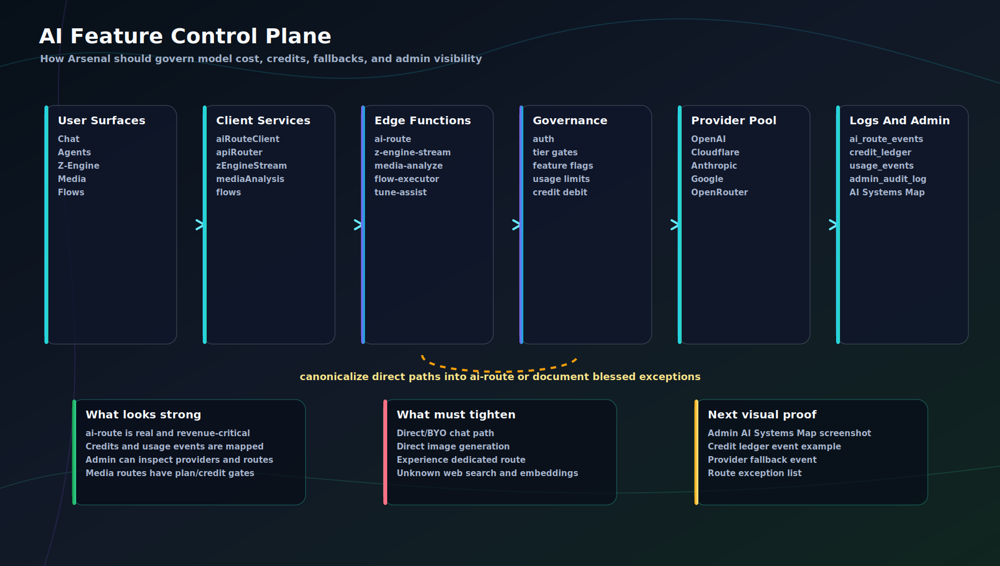
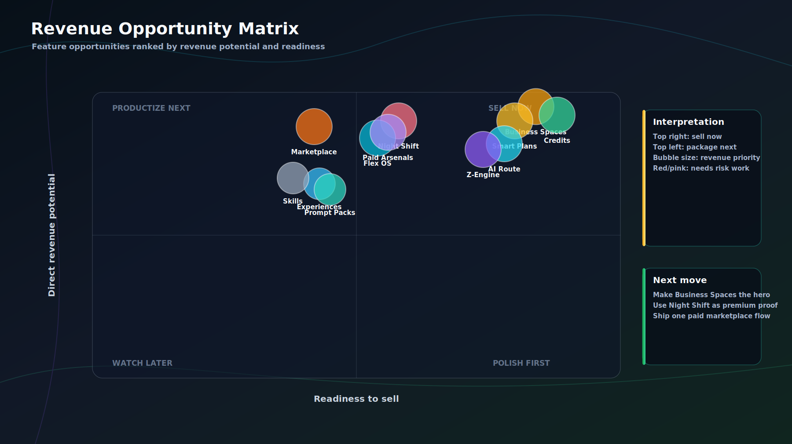
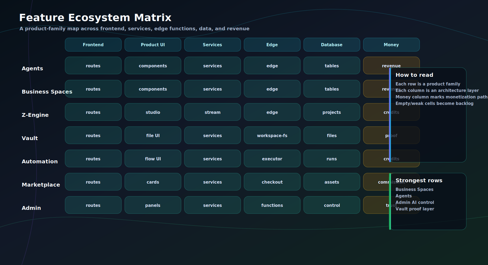
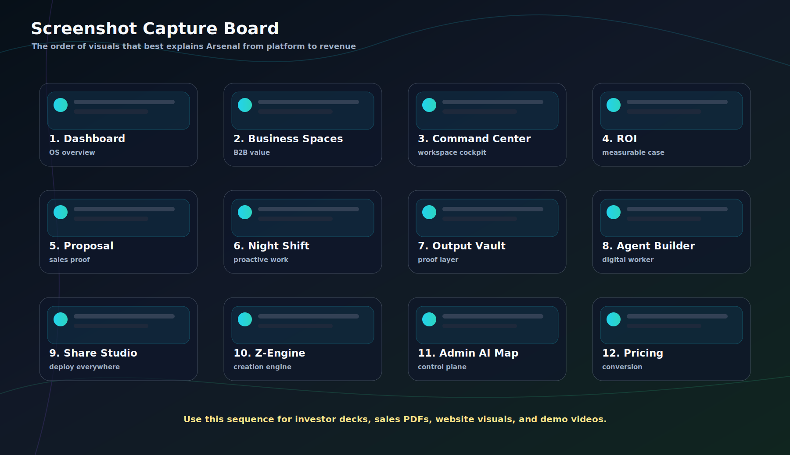
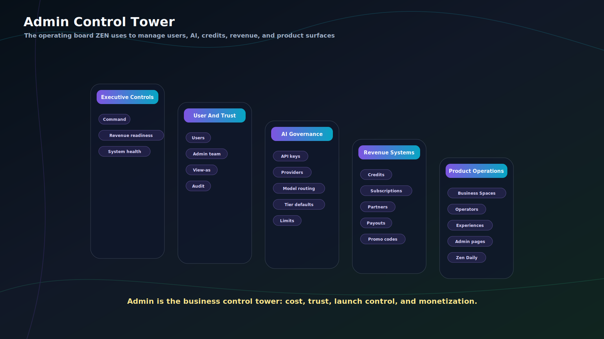
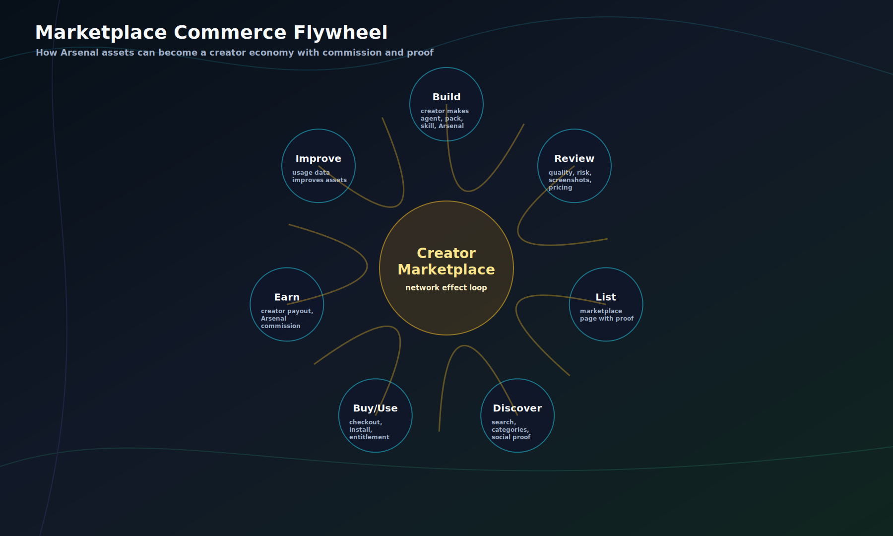
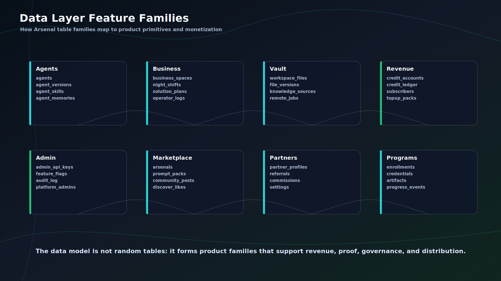

# Premium Graphics Gallery

These SVG graphics are designed to be viewed directly in GitHub, used in decks, or handed to a designer as layout direction.

## Arsenal Platform Command Map

The full operating-system map: workforce, Business Spaces, creation engines, Vault, distribution, revenue, and control plane.

## Business Spaces Revenue Engine

The flagship commercial story from pain point to paid execution and proof.

## AI Feature Control Plane

The governance architecture for model routing, credits, fallbacks, and admin visibility.

## Revenue Opportunity Matrix

Readiness vs revenue potential with priority bubbles.

## Feature Ecosystem Matrix

Feature families across frontend, product UI, services, edge functions, data, and money.

## Screenshot Capture Board

A 12-frame visual storyboard for decks, sales PDFs, web, and video.

## Admin Control Tower

The operational command structure for users, AI, credits, revenue, and product ops.

## Marketplace Commerce Flywheel

The creator economy loop: build, review, list, discover, buy, earn, improve.

## Data Layer Feature Families

How database families map to product primitives and monetization.

