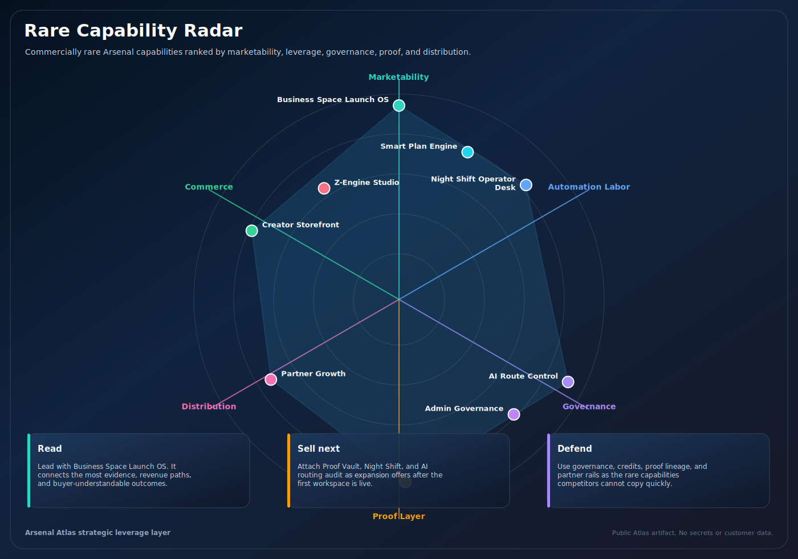
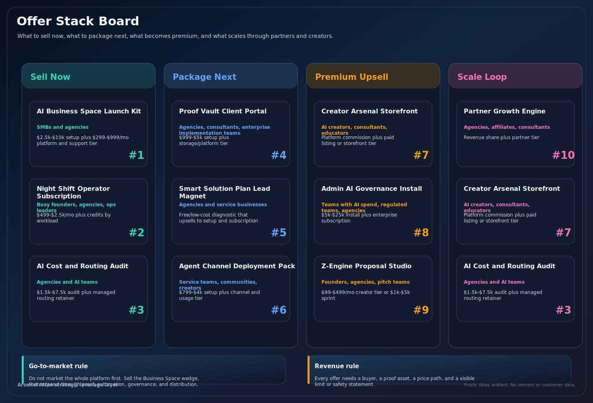
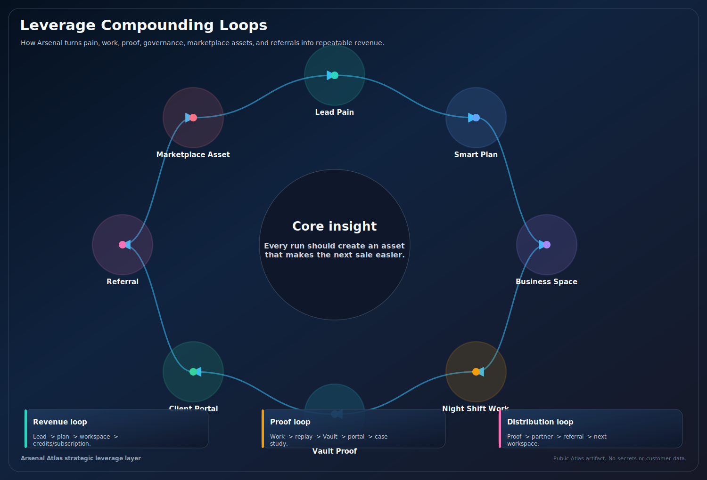
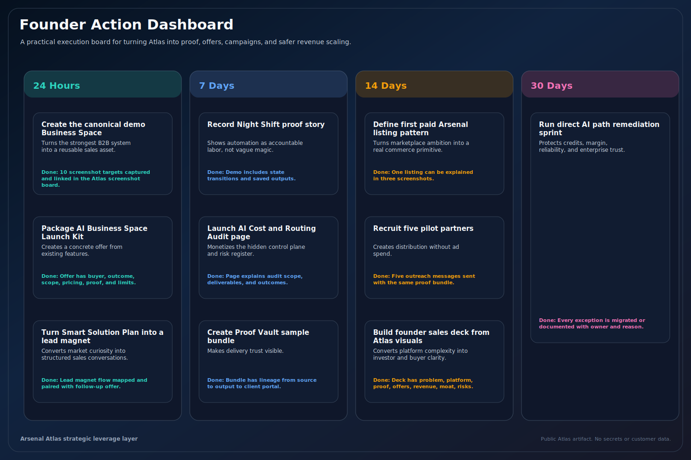
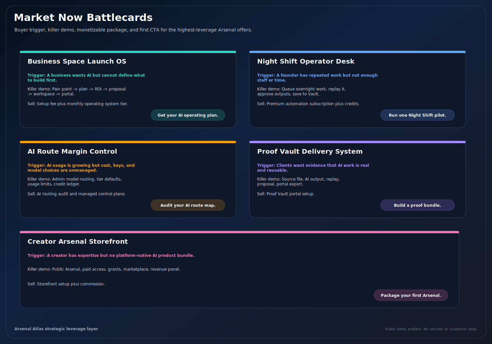
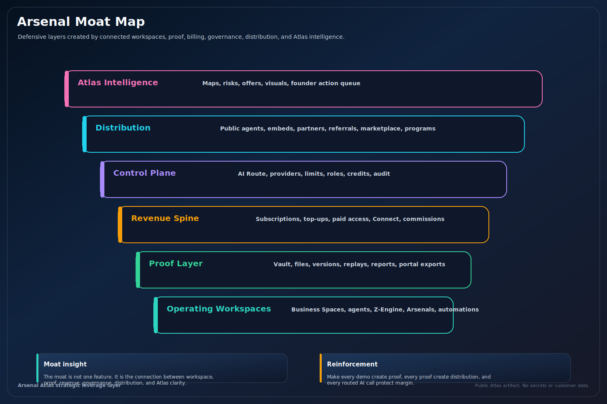
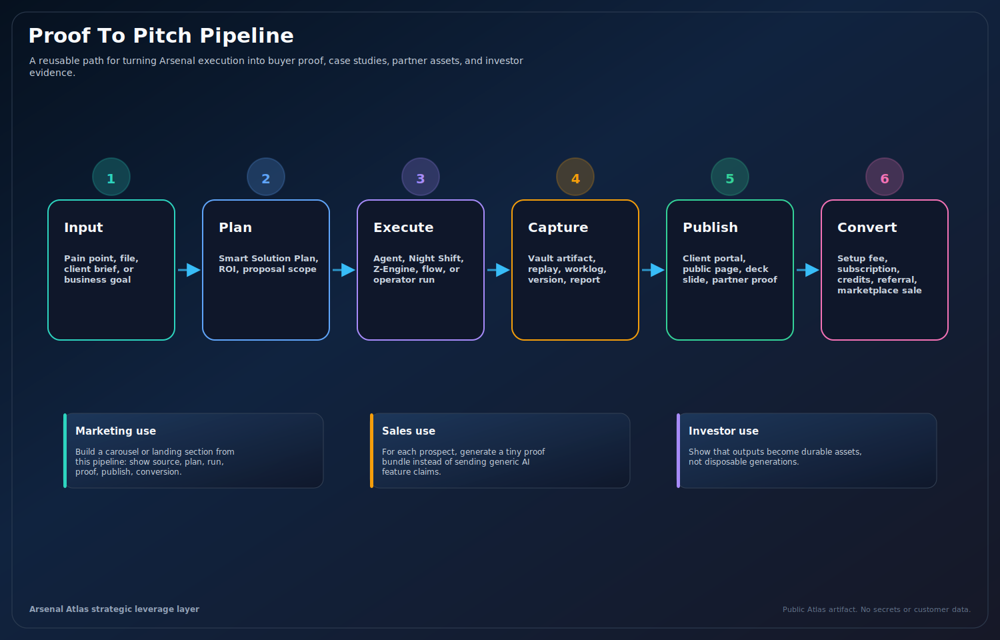

# Rare Capabilities Gallery

The graphics in this section translate Arsenal's strongest hidden leverage into visual assets that can be used in decks, strategy docs, sales pages, or launch planning.

| Graphic | What It Explains | Best Use |
| --- | --- | --- |
| Rare Capability Radar | Which capabilities are most commercially rare and defensible | Investor and founder overview |
| Offer Stack Board | What to sell first, next, premium, and scale | Revenue planning |
| Leverage Compounding Loops | How features create proof, margin, distribution, and repeatability | Moat narrative |
| Founder Action Dashboard | What to execute in 24 hours, 7 days, 14 days, and 30 days | Operating plan |
| Market Now Battlecards | Buyer triggers, killer demos, first CTAs | Marketing and sales enablement |
| Arsenal Moat Map | Defensive layers and reinforcement actions | Investor story |
| Proof To Pitch Pipeline | How outputs become sales proof | Sales content and case studies |

